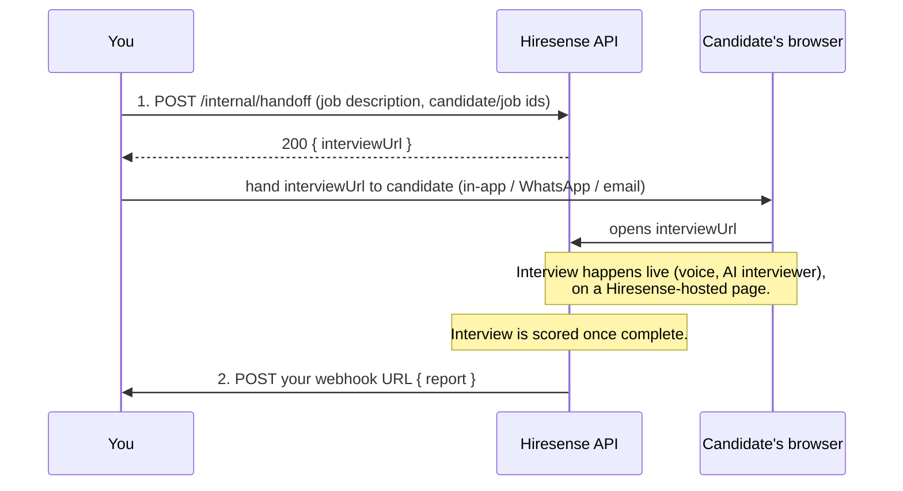
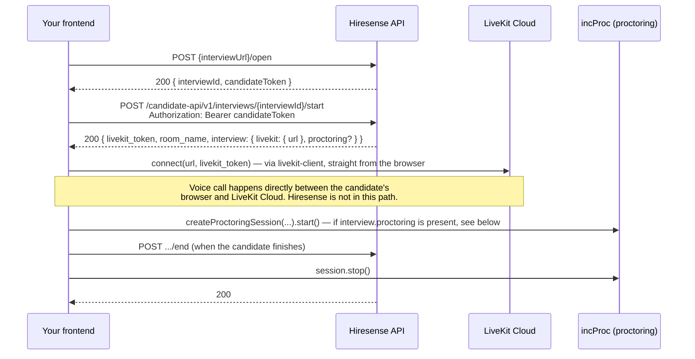

# Hiresense Handoff API — Integration Guide

Send a candidate through a live, AI-run Hiresense interview with **zero account creation on
their end**. You make one call to start a session and receive one webhook when the scored
report is ready. Machine-readable contract: [mobius-handoff-v1.yaml](openapi/mobius-handoff-v1.yaml) ([interactive API reference](api/)).

Two ways to run the interview itself:

- **Hosted** (default, simplest): the candidate leaves your site and opens a Hiresense-hosted
  page. Nothing to build beyond the one API call — see "Flow" below.
- **Embedded** (headless): the candidate never leaves your frontend — you drive the interview
  (voice call UI, device check, transcript, end) from your own code, calling Hiresense's APIs
  directly. See "Embedding on your own frontend" below.

Both share the same `POST /internal/handoff` call and the same webhook for the scored report.

## Flow (hosted)

You only ever touch two things: one API call, and one webhook you receive later. Everything
else happens automatically between the candidate's browser and Hiresense.



**Step-by-step, in words:**

1. **You call `POST /internal/handoff`** with the job description and your own
   candidate/job identifiers. You get back a one-time `interviewUrl`.
2. **You deliver `interviewUrl`** to the candidate over whatever channel you like — it's a
   plain URL, not tied to any specific delivery mechanism.
3. **Candidate opens the link.** Hiresense takes it from there — no Hiresense
   account/password required, just an opaque one-time session — and puts the candidate
   straight into a live AI-run interview (voice call), hosted on a Hiresense page.
4. **The interview runs to completion and is scored automatically.** This is the slow step
   (the scoring involves a fair amount of processing), which is why the report is delivered
   asynchronously via webhook rather than as a response anywhere in this flow.
5. **We POST the finished report to your webhook URL.** You can also pull the same report on
   demand with `GET /internal/handoff/report` (see below) instead of, or alongside, the
   webhook — and see "Embedding" below for the embedded flow's own poll-friendly feedback
   endpoint.

## 1. Create a handoff — `POST /internal/handoff`

**Auth:** header `X-Internal-Token: <your token>` — a secret we issue you out of band.
Request is rejected `401` (`{ "success": false, "error": "unauthorized", "message": "unauthorized" }`)
without it. **This token is your entire identity on every call** —
there is no `partner` field anywhere; do not send one, it would be ignored. Whatever this
token identifies you as is whose data you create and read.

**Request body:**

```json
{
  "externalCandidateId": "your-candidate-id",
  "externalJobId": "your-job-id",
  "jd": "full job description text",
  "parsedJd": { "title": "Senior Backend Engineer", "required_skills": ["Go", "PostgreSQL"] },
  "profile": { "any": "candidate profile JSON you want carried into the interview context" },
  "isPractice": false,
  "returnUrl": "https://your-registered-domain.example.com/candidates/42"
}
```

`externalCandidateId`, `externalJobId`, `jd` are required (400 if any is missing). `jd` is
always required, even when `parsedJd` is also sent — it's kept as the underlying job
description text.

`parsedJd` is optional. If you've already parsed this job description on your side, send your
structured version here and we'll use it directly instead of re-parsing `jd` — useful if your
own extraction is more accurate than a generic re-parse would be. Recognized fields (all
optional, extra fields are ignored, and a partial object is fine):

| Field | Type |
| --- | --- |
| `title`, `company`, `location`, `employment_type`, `experience_level`, `work_mode`, `salary`, `summary`, `department`, `application_instructions` | string |
| `required_skills`, `preferred_skills`, `key_highlights` | array of short strings |
| `requirements`, `responsibilities`, `qualifications`, `benefits` | array of full sentences |

Omit `parsedJd` entirely (or send `{}`) and we parse `jd` ourselves — same as before.

`profile` is optional — the candidate's resume/profile data. It's stored as the candidate's
resume for this interview and drives the resume-based report sections (`resume_claims_tested`,
`beyond_the_resume` in `reportV2`). Report generation only pulls readable text out of a
handful of recognized keys — `description`, `raw_text`, `text`, `content`, `summary` (first one
found) — anything else is passed through as a raw JSON blob to the model as-is, which still
works but scores worse than clean prose. **For best results, put the resume as plain text under
`profile.text`.** `isPractice` (optional, default `false`) flags the session as a practice run
rather than a real interview — only changes what the candidate sees on screen, doesn't change
how the report is scored or delivered. `returnUrl` is optional — see "Returning the candidate
to your app" below; omit it and no return button is shown.

**Response `200`:**

```json
{ "interviewUrl": "https://hiresense-api.dc-forte.com/handoff/<token>", "isResend": false, "resendCount": 1 }
```

`interviewUrl` is a single-use-until-expiry, channel-agnostic link — safe to drop into an
in-app message, WhatsApp, or email as-is. It expires 7 days after creation. There's no way to
recover a lost URL — call the endpoint again to mint a new one for the same candidate/job.

**Resending / re-triggering:** calling this endpoint again for the same
`externalCandidateId`+`externalJobId` pair is a resend, not a new session — you get a fresh
`interviewUrl` for the same underlying interview (or a new one, if the candidate never opened
the first link), `isResend: true`, and an incremented `resendCount`. After 3 resends within a
6-hour window, the endpoint returns `500` with body `{"error": "resend cooldown active, try
again later"}` until the window passes — back off and retry later rather than looping.

**Errors:** `400` invalid/missing fields (or an invalid `returnUrl`, see below), `500` internal
error or the resend cooldown above — body is `{"error": "<message>"}`.

### Returning the candidate to your app

Set `returnUrl` to have the candidate's results page show a "Return to your app" button that
navigates back to your app once they're done. Requirements:

- Must be `https`.
- Must be on a host we've registered for you ahead of time — tell us the exact domain
  (`app.yourcompany.example.com`) before relying on this; an unregistered host is rejected with
  `400`, not silently ignored.
- The path/query past the host is entirely up to you (e.g.
  `https://app.yourcompany.example.com/candidates/42?source=hiresense`) — we store and use it
  as-is once the host check passes.
- Omit it (or send `""`) and no button is shown.

## 2. Candidate opens the link

Nothing for you to call — `interviewUrl` (`GET /handoff/{token}`) is opened directly by the
candidate's browser, from whichever channel you delivered it through. First open: creates the
session and puts the candidate into the interview. Re-open (same link, before expiry): resumes
the same session rather than starting a new one. Expired or unknown link → `404`.

## Embedding on your own frontend (headless)

If you'd rather the candidate never leave your site, don't open `interviewUrl` in the browser —
call its `/open` variant from your own frontend instead, then drive the interview yourself.



**1. Exchange the token for a session, in JSON instead of opening it as a page:**

`POST {interviewUrl}/open` — i.e. append `/open` to the `interviewUrl` you got back from
`POST /internal/handoff` (`POST https://hiresense-api.dc-forte.com/handoff/<token>/open`).
Call this from your frontend via a normal cross-origin `fetch`/XHR — CORS is allowlisted for
your registered frontend origin (see "Before going live" below, same one-time registration as
the webhook URL / `returnUrl` host). Same first-open-vs-reopen semantics as the hosted
`GET /handoff/{token}`: first call creates the guest session + interview, a repeat call (same
link, before expiry) resumes it.

**Response `200`:**

```json
{ "interviewId": "a1b2c3d4-...", "candidateToken": "eyJhbGciOi..." }
```

`candidateToken` is a bearer token (7-day TTL) identifying the candidate's guest session — treat
it like any other access token: keep it in memory/session storage on your frontend, don't log
it. `returnUrl` echoes back what you sent as `returnUrl` in `POST /internal/handoff`, if
anything — not meaningful for an embedded integration (there's no "return to your app" button to
show, the candidate never left it), included for parity with the hosted flow's interview record.
**The key is omitted entirely (not sent as `null`) if you didn't set `returnUrl`** — check for
its presence, don't assume it's always in the response body.

**2. Drive the interview with that token.** Every call below goes to Hiresense's API (not
LiveKit) with header `Authorization: Bearer <candidateToken>`:

| Call | Purpose |
| --- | --- |
| `POST /candidate-api/v1/interviews/{interviewId}/start` | Provisions the LiveKit room and dispatches the AI interviewer. Returns `{ livekit_token, room_name, interview: { livekit: { url }, proctoring? } }` — `interview.proctoring` (`{ sessionId, sessionToken, baseUrl }`) is present only once incProc's SDK integration is live on our side (see "incProc proctoring SDK" below); until then it's simply absent, not an error. Call once per session — safe to retry if it fails, calling again on an already-started interview reuses the same room rather than creating a new one (the proctoring session is minted once too, not re-minted on retry). |
| `POST /candidate-api/v1/interviews/{interviewId}/device-check` | Optional — record that the candidate passed a mic/camera check before starting. |
| `POST /candidate-api/v1/interviews/{interviewId}/end` | Ends the interview once the candidate is done. Triggers scoring. |
| `GET /candidate-api/v1/interviews/{interviewId}/feedback` | Poll this if you want the report in your own UI instead of (or in addition to) waiting on the webhook — `404` until it's ready. **Shape differs from the webhook/pull-report envelope**: this response is *not* wrapped in `{report, reportV2}` — the report's own fields (`overallScore`, `recommendation`, etc.) and `reportV2` (when present) are all at the top level directly, since there's no externalCandidateId/externalJobId to wrap here. |
| `GET /candidate-api/v1/interviews/{interviewId}/recording/playback` | Fetch a short-lived playback URL for the server-side proctoring recording (see "Proctoring recording" below). `404` until the interview is complete and the recording has finished processing, or if no video was ever published (audio-only interview). |
| `GET /api/interviewhandoff/livekit-interview/conversation/{interviewId}` | One-time backfill of the transcript so far. |
| `GET /ws/transcript/{interviewId}` (WebSocket, same host, `ws(s)://`) | Live transcript stream — new turns pushed as the interview happens. No auth header needed (the interview ID itself is the credential, same trust model as the transcript backfill call). |

All candidate-api calls (`start`/`device-check`/`end`/`feedback`/`recording/playback`) share the
same `401`: missing, expired, or malformed `candidateToken` → `{ "success": false, "error":
"authentication required" }`. Note the key is `success`, not `ok` — this comes from a different
error helper than the `409`/`503` bodies below, so don't assume one shape for every error on
these endpoints.

`start` error responses, beyond that `401`:

| Status | Body | Meaning / what to do |
| --- | --- | --- |
| `409` | `{ "ok": false, "error": "invalid_transition", "current": "<status>" }` | Interview is already `completed`/`feedback_pending`/`feedback_ready` — don't retry, route the candidate to the feedback screen instead. |
| `503` | `{ "ok": false, "error": "interviewer_unavailable", "message": "...", "retry_action": { "kind": "retry_later", "after_ms": 10000 } }` | AI interviewer couldn't be dispatched (rare — usually a cold-start race). Show a retry prompt and call `start` again after `retry_action.after_ms`. |

`end`'s error shape mirrors `start`'s `409` (`invalid_transition`) if called before the interview
is `in_progress`, and returns `{ ok: true, already_ended: true, ... }` (still `200`) if called
twice — safe to call unconditionally when the candidate clicks "finish", no need to track local
state to avoid a double-call.

**3. Join the voice call.** Use the `livekit_token` and `livekit.url` from `start` with a LiveKit
browser SDK. This connects directly from the candidate's browser to LiveKit Cloud — Hiresense's
API is not in that path at all, so there's nothing to proxy and no extra CORS setup needed for
this specific step (LiveKit's own CORS/WebSocket policy applies, not Hiresense's).

The one easy way to get this subtly wrong: **you must render the AI interviewer's remote audio
track, or the candidate will see a connected call and hear nothing.** The reference
implementation (Hiresense's own candidate frontend) uses
[`@livekit/components-react`](https://www.npmjs.com/package/@livekit/components-react)'s
`<RoomAudioRenderer />`, which auto-attaches every remote participant's audio track to a hidden
`<audio>` element — that's the easiest correct path if you're on React:

```tsx
import { LiveKitRoom, RoomAudioRenderer } from '@livekit/components-react';

<LiveKitRoom
  serverUrl={start.interview.livekit.url}
  token={start.livekit_token}
  connect
  audio  // publish the candidate's own mic — required, the interview is voice-driven
  video  // publish the candidate's camera — required for proctoring, see below
  onDisconnected={() => { /* your own cleanup */ }}
>
  <RoomAudioRenderer />  {/* plays the AI interviewer's voice — do not skip this */}
  {/* your own UI: mute button, end-call button, transcript panel, etc. */}
</LiveKitRoom>
```

If you're not on React, use plain [`livekit-client`](https://www.npmjs.com/package/livekit-client)
and subscribe/attach manually:

```ts
import { Room, RoomEvent, Track } from 'livekit-client';

const room = new Room();

room.on(RoomEvent.TrackSubscribed, (track, _pub, participant) => {
  if (track.kind === Track.Kind.Audio && participant.identity !== room.localParticipant.identity) {
    document.body.appendChild(track.attach()); // creates and plays an <audio> element
  }
});

await room.connect(start.interview.livekit.url, start.livekit_token);
await room.localParticipant.setMicrophoneEnabled(true); // candidate's mic must be published for the interview to hear them
await room.localParticipant.setCameraEnabled(true);      // candidate's camera must be published for proctoring, see below
```

Either way: publish both the candidate's microphone (`audio: true` / `setMicrophoneEnabled(true)`)
— without it the AI interviewer has no audio from the candidate — and camera (`video: true` /
`setCameraEnabled(true)`) — without it there's no proctoring recording, see below. Also handle
`RoomEvent.Disconnected`/reconnect states for your own connection-status UI (LiveKit's SDK
auto-reconnects on transient network drops; you don't need to reimplement that, just reflect the
state).

### Proctoring recording

Hiresense records every interview server-side, as **two separate files**: a candidate-only
recording used exclusively for Hiresense's own proctoring analysis (never exposed to you or any
partner), and a full room-composite recording — candidate audio/video **plus the AI
interviewer's voice** mixed in — which is what `recording/playback` below serves you. Both start
automatically once the room is created and need no call from you, but the composite recording
only captures candidate video if your frontend actually publishes a camera track (see the
`video`/`setCameraEnabled(true)` calls above). If you don't publish video, the interview still
runs normally — you just get an audio-only recording (candidate audio + AI voice).

**You are responsible for obtaining the candidate's consent to webcam recording before they join
the call.** This is explicit-consent territory in most privacy regimes (biometric/webcam data),
and since the candidate is in *your* UI, Hiresense's own consent screen (used for its
hosted-flow candidates) never renders for yours — there is no consent screen anywhere in this
API contract. This note is not legal advice; confirm the exact consent language and timing with
your own counsel/DPO.

**Retrieving the recording:** call `GET /candidate-api/v1/interviews/{interviewId}/recording/playback`
with the same `Authorization: Bearer <candidateToken>` you use for every other candidate-api call.

**Response `200`:**

```json
{ "ok": true, "status": "completed", "playbackUrl": "https://...", "duration": 812, "expiresAt": "2026-09-18T12:00:00Z" }
```

`playbackUrl` is a presigned URL, valid for **1 hour** — don't cache it past `expiresAt`, call
this endpoint again to get a fresh one instead. `status` is `"completed"` or `"merge_failed"`
(egress recorded but the server-side file processing failed — treat like a missing recording,
nothing to retry on your end). `duration` is in seconds, `null` if unknown.

**`404`** means one of: the interview hasn't finished yet, the recording is still being
processed, or the candidate never published a video track (audio-only interview — see
"publish both the candidate's microphone... and camera" above) so there's nothing to serve.

### incProc proctoring SDK

Separate from the server-side recording above: Hiresense also runs a real-time proctoring
integration (incProc — tab-switch/window-blur signals, periodic evidence frames) that has to run
**in your frontend**, since it watches your page, not ours. This is optional per interview —
`start`'s response only carries an `interview.proctoring` block once this is enabled for your
integration; treat its absence as "not enabled for this interview," never as an error, and don't
block the interview on it either way.

**1. Install the SDK, version `1.0.4` or later** (zero dependencies):
`npm install @incproctor/proctoring-sdk@^1.0.4`. `1.0.4` added `checkReachable()` (step 2 below)
— anything older can't do the reachability check.

**2. Before starting the interview, check that the candidate's browser can actually reach
incProc.** A browser extension (Brave Shields, an ad-blocker) can silently block every proctoring
request — without this check, that session looks byte-for-byte identical to a candidate with zero
violations (see "Event delivery isn't guaranteed" below for the same failure mode once a session
is already running). `checkReachable()` needs no session and uses no credits, so it's safe to call
as soon as `interview.proctoring.baseUrl` is known, before LiveKit connect:

```ts
import { checkReachable } from '@incproctor/proctoring-sdk';

if (start.interview.proctoring) {
  const status = await checkReachable(start.interview.proctoring.baseUrl, { timeoutMs: 8000 });
  // 'ok' | 'blocked' | 'offline'
  if (status !== 'ok') {
    // Don't start the interview yet — show the candidate what to fix and let them retry
    // (re-running checkReachable() is enough; no need to call `start` again).
    // 'blocked': "Turn off Brave Shields (lion icon in the address bar) or your ad blocker
    //             for this site — or use Chrome, Edge, or Firefox."
    // 'offline': "Check your internet connection and try again."
    return;
  }
}
```

**3. Once reachable, start a session right after connecting to LiveKit:**

```ts
import { createProctoringSession, checkSupport } from '@incproctor/proctoring-sdk';

if (start.interview.proctoring) {
  const { sessionId, sessionToken, baseUrl } = start.interview.proctoring;
  if (checkSupport().supported) {
    const session = createProctoringSession({
      baseUrl,
      session: { session_id: sessionId, session_token: sessionToken, reference_id: interviewId },
      camera: { enabled: true, required: false }, // fail open — a denied camera must not block the exam
      evidence: { enabled: true, intervalSec: 15, sources: ['camera'], maxDimension: 640 },
    });
    await session.start();
    // keep `session` around — you need it again at step 4
  }
}
```

`sessionId` and `sessionToken` are **both** required by the SDK's `SessionCredentials` type —
`sessionToken` alone isn't enough, unlike most bearer-style tokens. Neither is your account's
incProc API key/secret — those never leave Hiresense's backend; only this short-lived,
per-interview `sessionToken` is safe to ship to a browser.

**4. Stop the session when the interview ends** — same moment you call `POST .../end` and
disconnect from LiveKit:

```ts
await session.stop('interview_ended');
```

Also call `session.destroy()` (synchronous, no network wait) from whatever cleanup path handles
an unexpected teardown — a route change, a tab close — where an `await` isn't available; see the
SDK's own doc comment on `destroy()` for why it exists alongside `stop()`.

**Origin — nothing to register.** incProc accepts the SDK from any origin by default; there is
no allowlist step on their side and nothing to tell us about this specifically. The one real
requirement: the origin your page opens the session from must exactly match the page the SDK
actually runs on (no trailing slash) — this falls out naturally from just running the SDK on your
real frontend, not something you configure separately.

**Event delivery isn't guaranteed — watch for silent drops.** A browser extension (ad-blocker,
privacy tool) can block the SDK's own event POSTs outright (`net::ERR_BLOCKED_BY_CLIENT` in
Chrome, observed in our own testing) — the request never reaches incProc at all, and a session
like this looks identical to a candidate with zero violations: an empty events log either way.
Recommended: wire `session.onError(...)` (an error with `reachedServer: false` means the request
never left the browser — a network/client problem, not incProc rejecting anything) and check
`session.getStatus().events` before `stop()` — `dropped > 0` is incProc's own documented alert
signal, but only fires once their 500-event retry queue overflows, which a normal-length
interview with *every* event failing may never reach; `sent === 0` with `generated > 0` catches
that case too. None of this should block the interview — same fail-open posture as everything
else in this section, it's purely for knowing which sessions have incomplete proctoring coverage.

**5. Recommended UI flow:**

1. Candidate lands on your page → call `POST {interviewUrl}/open` immediately (or on a "Start
   interview" click, your call) → store `candidateToken` + `interviewId` in memory.
2. Optional device-check screen → `POST .../device-check` once the candidate confirms mic access.
3. Call `POST .../start` → if `interview.proctoring` is present, `checkReachable()` it before
   proceeding — if it's not `'ok'`, stop here and show the candidate the fix, don't render the
   interview UI. Otherwise, render your interview UI, connect to LiveKit with the returned token →
   if `interview.proctoring` is present, start the incProc session too (see above).
4. While connected: render the transcript from the WS stream (backfill first via the
   `conversation` endpoint, then append WS turns — see `useTranscriptSocket` in
   `chapter-interview-frontend` for the reference implementation of this exact pattern).
5. Candidate clicks "End interview" (or the AI interviewer signals completion via a transcript
   turn/data message, if you want to auto-detect it) → `POST .../end` → stop the incProc session
   (if one was started) → disconnect the LiveKit room → show a "scoring in progress" state.
6. Either poll `GET .../feedback` (every few seconds, treating `404` as "not ready yet") or wait
   for your webhook — whichever fits your UI better. The webhook is authoritative either way.

## 3. Receive the report — your webhook

Once the interview finishes and scoring completes, we POST the full report to your webhook
URL. Delivery is at-least-once, but **not indefinitely retried**: a failed attempt (any
non-2xx response or network error) is retried on a 30s poll, capped at **5 attempts total
(~2.5 minutes)** — after that the delivery is abandoned permanently, not retried again on its
own. Your endpoint should be idempotent on `externalCandidateId`+`externalJobId` regardless,
since a retry can still redeliver the same report more than once before the cap is hit.

**This makes `GET /internal/handoff/report` (below) more than optional reconciliation**: if
your webhook endpoint is down for longer than the retry window, the push delivery is lost for
good. Recover it by pulling the report on demand, or by resending — calling
`POST /internal/handoff` again for the same `externalCandidateId`+`externalJobId` pair resets
the attempt count and re-arms delivery.

**Request you'll receive:**

- `POST <your webhook URL>` (the one you gave us when we set up your integration)
- Header `X-Internal-Token: <your token>` — same secret as step 1, verify it on your side.
- Body:

```json
{
  "externalCandidateId": "your-candidate-id",
  "externalJobId": "your-job-id",
  "reportV2": { "...": "the full recruiter-facing report, see below" }
}
```

**`reportV2` is the only report shape delivered here** — no separate legacy `report` field.
An interview whose report isn't on the current pipeline yet simply isn't delivered (see
"pull the report" below for what that looks like on that endpoint).

**Interviews under 5 minutes never get a report.** Too little transcript for any verdict to
mean something, so no report is generated at all — not delayed, not degraded, never. Instead
of `reportV2`, the body carries `"endedEarly": true` and delivery is marked done immediately
(this is a terminal state, not a retry candidate):

```json
{
  "externalCandidateId": "your-candidate-id",
  "externalJobId": "your-job-id",
  "endedEarly": true
}
```

A body will always have exactly one of `reportV2` or `endedEarly`, never both.

**`connectionEndReason` is optional and arrives alongside `reportV2`**, not instead of it — the
interview had enough content for a real, scored report, it just didn't end the way the
interview plan intended. One of `"deliberate"` (candidate/AI finished normally — you can
usually ignore this), `"dropped"` (connection lost mid-interview — network issue, tab close,
or a crash on our side, candidate never explicitly finished), or `"timeout"` (hit the maximum
allowed duration with no explicit end). Omitted entirely when we don't have a reliable signal.
Never present on an `endedEarly` payload.

```json
{
  "externalCandidateId": "your-candidate-id",
  "externalJobId": "your-job-id",
  "reportV2": { "...": "same report shape as below" },
  "connectionEndReason": "dropped"
}
```

**`proctoring_summary` is optional too, and arrives alongside `reportV2` the same way** —
present only once video-analysis proctoring has completed for this interview. Its absence on a
delivery does not mean proctoring failed; it's frequently just not finished yet, and can arrive
on a **later** delivery of the same interview (see "delivery can happen more than once" below).
`status` is one of `"clean"`, `"caution"`, `"flagged"`, or `"unverified"` — the highest-severity
status across every answer. `non_clean_count`/`total_count` are how many answers weren't
`clean`, out of how many total (0 when `status` is `"clean"`). Each `per_question_breakdown[]`
entry also carries its own `proctoring: { "status": "...", "summary": "..." }`, present/absent in
lockstep with this top-level field. `summary` is one composed sentence covering that answer's
duration, recorded time away from the screen, and any relevant findings — e.g. `"120 second
answer, looked away for 18 seconds, mobile phone detected"`. Both fields are computed entirely
from platform proctoring events (attention tracking, device/face detection) — never derived from
the transcript, never asked of any AI model; `summary` is safe to render as-is.

```json
{
  "externalCandidateId": "your-candidate-id",
  "externalJobId": "your-job-id",
  "reportV2": { "...": "same report shape as below, per_question_breakdown entries each carry their own proctoring field with status + summary" },
  "proctoring_summary": { "status": "caution", "non_clean_count": 1, "total_count": 5 }
}
```

**Delivery can happen more than once per interview.** Video-analysis proctoring frequently
completes after the report itself and after the first webhook delivery — confirmed on real
traffic: roughly half the time, by up to several minutes. When that happens, this webhook
fires a **second** time for the same interview, with `proctoring_summary` (and each question's
`proctoring` field) now populated. Treat a second delivery for an interview you've already
received as an **update to replace your stored copy with**, not a duplicate event to discard or
a new interview to ingest again — key it on `externalCandidateId` + `externalJobId`, same as
the idempotency key you already use for at-least-once retries. If you'd rather not handle a
second delivery, re-pull `GET /internal/handoff/report` instead of relying solely on the push —
it always reflects current state.

**Respond `2xx`** to acknowledge — anything else is treated as failed and retried.

### Alternative: pull the report — `GET /internal/handoff/report`

The webhook is at-least-once, not guaranteed-delivered (if your endpoint is down through our
retry window, delivery stops). If you want a way to check on-demand — for reconciliation, a
retry button, or instead of relying on the webhook at all — call this endpoint with the same
`X-Internal-Token` auth as `POST /internal/handoff`.

**Request:** `GET /internal/handoff/report?externalCandidateId=<id>&externalJobId=<id>` — the
same pair you sent to `POST /internal/handoff` for this candidate/job.

**Response `200`:** identical shape to the webhook body — either `reportV2` or, for an
interview that ended before the 5-minute minimum (see above), `"endedEarly": true` in its
place. A `200` with `endedEarly` is terminal, not "check back later" — that interview will
never produce a report. `connectionEndReason` and `proctoring_summary` (see above) are included
the same way when present, alongside `reportV2` — this endpoint always reflects current state,
so it's the reliable way to pick up `proctoring_summary` once it lands, even if you don't want
to handle a second webhook delivery.

```json
{
  "externalCandidateId": "your-candidate-id",
  "externalJobId": "your-job-id",
  "reportV2": { "...": "same report shape as the webhook, see below" }
}
```

**`404`** (no body schema to rely on beyond `{"error": "<message>"}`) covers every "not ready
yet" case — no handoff session for that candidate/job pair, the candidate hasn't opened the
interview link yet, the interview isn't `completed`/`feedback_ready`, feedback hasn't finished
generating, or (rare) it finished on an older pipeline with no `reportV2` to deliver. These
aren't distinguished from each other in the response — treat any `404` here the same way you'd
treat "keep waiting for the webhook." (An `endedEarly` interview is the one exception: it's a
`200`, not a `404` — see above.)

**`400`** if either query param is missing.

This is a genuinely separate code path from the webhook sender, not a wrapper around it, but
builds the exact same report shape — so the two should never disagree on content, only on
whether it's shown to you push- or pull-first.

### Getting playable answer clips — `GET /internal/handoff/interviews/{interviewId}/clips`

`reportV2` (see below) carries a `clip` object next to some quotes — `{"message_id": "...",
"index": 0}`. `message_id` is internal and not something you can use directly; `index` is what
you use. Call this endpoint once per interview and match its results back to the `clip.index`
values you found in `reportV2` — you never need to look up or send a message id yourself.

**Request:** `GET /internal/handoff/interviews/{interviewId}/clips` — same `X-Internal-Token`
auth as everything else. `{interviewId}` is the `interviewId` field already present in every
`report`/`reportV2` you receive.

**Response `200`:**

```json
{
  "interviewId": "8f2c1e40-...",
  "clips": [
    { "index": 0, "url": "https://.../clip-0.m4a?X-Amz-..." },
    { "index": 2, "url": "https://.../clip-2.m4a?X-Amz-..." }
  ]
}
```

- `clips` only lists indexes that actually resolved to a playable clip — a gap (an index present
  in `reportV2` but missing here) means that one clip isn't available right now, not an error.
  An empty array is a valid response (no clips available yet, or the interview predates this
  feature), not a failure.
- Each `url` is short-lived (about an hour) — call this endpoint again if it's expired by the
  time you need to play it, don't cache it long-term.
- `404` covers an unrecognized `interviewId`, or one that isn't yours — treated identically, we
  don't confirm whether an interview you don't own exists.

### Getting the full recording — `GET /internal/handoff/interviews/{interviewId}/recording`

For a recruiter dashboard reviewing an interview after the fact — distinct from the embedded
flow's own `GET /candidate-api/v1/interviews/{interviewId}/recording/playback`, which is
`candidateToken`-gated and scoped to the candidate's 7-day session (useless once you're
reviewing weeks later). Same `X-Internal-Token` auth and partner-ownership rules as `/clips`
above.

**Response `200`:** identical shape to the embedded flow's own recording/playback response —

```json
{ "ok": true, "status": "completed", "playbackUrl": "https://...", "duration": 1834, "expiresAt": "2026-09-23T13:00:00Z" }
```

`playbackUrl` is presigned, valid for **1 hour** — re-call this endpoint for a fresh one rather
than caching it. `status` is `"completed"` or `"merge_failed"` (recording captured but
server-side processing failed — treat like no recording, nothing to retry on your end). `404`
covers an unrecognized/not-yours `interviewId` (treated identically), no recording yet
(interview still in progress or processing), or no recording at all (audio-only interview, no
camera track ever published — see "Proctoring recording" above).

### Getting the proctoring events log — `GET /internal/handoff/interviews/{interviewId}/proctoring-log`

Only relevant if incProc proctoring is enabled for your integration (see "incProc proctoring
SDK" above). Merges two independent incProc data sources into one chronological log: the
post-call video analysis (looking-away/multiple-faces/device-detected — fetched off the
video-analyze completion webhook) and the live browser-SDK session's own event log
(tab-hidden/fullscreen-exited — fetched once, best-effort, when the interview ends). Both are
read from what Hiresense already persisted — this endpoint never calls incProc live, so it's
always fast and never fails because incProc is slow or unreachable.

**Response `200`:**

```json
{
  "interviewId": "8f2c1e40-...",
  "events": [
    { "start": "2026-09-21T11:39:23Z", "end": "2026-09-21T11:39:36Z", "duration_sec": 13, "description": "Interview tab no longer visible", "source": "browser_session" },
    { "start": "2026-09-21T11:41:31Z", "end": null, "duration_sec": null, "description": "Exited fullscreen mode", "source": "browser_session" },
    { "start": "2026-09-21T11:44:12Z", "end": "2026-09-21T11:44:19Z", "duration_sec": 7, "description": "Candidate looking away from screen", "source": "video_analysis" }
  ]
}
```

- An empty `events` array is a valid response — proctoring wasn't enabled for this interview, or
  no violations were detected — not a failure.
- `end`/`duration_sec` are `null` for a point-in-time event (e.g. exiting fullscreen has no
  documented "re-entered fullscreen" counterpart in incProc's own event model, so we can't say
  when/whether it ended).
- `source` tells you which of the two underlying incProc mechanisms produced the row — not
  meaningful to act on differently, just provenance.
- `404` covers an unrecognized `interviewId`, or one that isn't yours — treated identically.

### Pausing/resuming the AI interviewer — `POST /internal/handoff/interviews/{interviewId}/pause` and `.../resume`

For when the candidate's camera or mic drops on your end and you want the AI interviewer to
stop mid-call — no new questions asked, no silence-nudging — until you send `resume`. There's
no candidate-facing pause button anywhere in this flow; this is entirely something you trigger.
Same `X-Internal-Token` auth and partner-ownership rules as `/clips` above.

**Request:** `POST /internal/handoff/interviews/{interviewId}/pause` (or `/resume`), same
`X-Internal-Token` header as every other `/internal/handoff` route, JSON body:

```json
{ "message": "One moment, we're checking your camera connection." }
```

`message` is optional. If you send it, the AI interviewer speaks it verbatim before going
silent (on `pause`) or before continuing (on `resume`); omit it and the pause/resume happens
with no announcement to the candidate.

**Response:** `204` on success. `404` covers an unrecognized `interviewId`, or one that isn't
yours — treated identically. Calling `pause` while already paused, or `resume` while not
paused, is a safe no-op — not an error.

While paused: the AI interviewer won't ask a new question, nudge the candidate for silence, or
auto-end the interview for inactivity, and won't respond to anything the candidate says until
you call `resume`. The interview's overall duration/time-remaining budget is **not** frozen —
it keeps counting the same as real wall-clock time, so a pause counts against the candidate's
allotted interview time. Don't leave an interview paused indefinitely if the candidate is still
on the call waiting.

### `report` shape (embedded flow's `GET .../feedback` poll only)

The webhook and `GET /internal/handoff/report` are `reportV2`-only (above) — this legacy flat
shape is sent **only** by the embedded flow's own
`GET /candidate-api/v1/interviews/{interviewId}/feedback` poll, alongside `reportV2`, for
backward compatibility with that specific endpoint's existing callers. Notable fields (not
exhaustive — treat unknown fields as forward-compatible additions):

| Field | Meaning |
| --- | --- |
| `overallScore` / `overall_score` | 0-100 |
| `recommendation` | `"strong_hire"` / `"hire"` / `"lean_hire"` / `"lean_no_hire"` / `"no_hire"` / `"reject"` (may read a notch lower than the raw interview quality if the interview was cut short — see `coverage_percentage`) |
| `categories` / `sections` | per-topic breakdown |
| `problem_solving`, `domain_knowledge`, `communication`, `behavioral_cultural_alignment`, `role_specific_competencies` | per-category detail blocks |
| `aiSummary` / `ai_summary` | narrative summary |
| `strengths`, `areasForImprovement` | bullet lists |
| `coverage_percentage`, `coverage_note` | how much of the planned interview the candidate actually completed |
| `candidateName` | always `"Unknown Candidate"` for your interviews — your candidates are always guest sessions with no Hiresense account, so there's never a real name to resolve |
| `jobTitle` | best-effort, extracted from the job description you sent — `"Unknown Position"` if extraction failed |

Every field is duplicated under both `camelCase` and `snake_case` keys — use whichever
convention is easier on your side, they carry the same value.

### `reportV2` shape

The full recruiter-facing report — richer than the legacy `report` shape above, and the
**only** shape the webhook and `GET /internal/handoff/report` deliver. Only present for
interviews scored under the current pipeline; an interview that isn't (rare — pre-dates the
pipeline, or is stuck on an old report row) just isn't delivered on those two endpoints, full
stop — see each endpoint's own "not ready" behavior above. The embedded flow's `/feedback`
poll is the one place both shapes still exist side by side, for that endpoint's own backward
compatibility.

**This is the schema the design mockup you were given was built from** — its sections map
1:1, in order, to `reportV2`'s eight top-level keys. Full field-level schema is in
`mobius-handoff-v1.yaml`'s `InterviewReportV2` component; this is the map from mockup section
to key:

| Mockup section | `reportV2` key |
| --- | --- |
| Hiring Recommendation / Interview Performance | `verdict` |
| Scored Dimensions | `scored_dimensions` |
| Per Question Feedback | `per_question_breakdown` |
| Where they are strong | `where_strong` |
| Where they are weak or untested | `where_weak_or_untested` |
| Resume claims tested | `resume_claims_tested` |
| Risk Assessment | `risk_assessment` |
| Next steps | `next_steps` |

Things worth knowing before you build against it:

- **The Proctoring Summary tile in the mockup is not part of `reportV2` at all.** We attach
  that status (Clean / Caution / Flagged / Unverified) from your own platform events
  separately, after the report is generated — it's never derived from the interview
  transcript. Source it the same way the mockup implies: as a sibling tile you populate from
  wherever your own proctoring signal lives, not from anything in this payload.
- **No red-flag count or list anywhere in `reportV2`.** Any integrity/behavior concern is
  already folded into `verdict.recommendation` — a critical one can lower the recommendation
  without moving `verdict.interview_performance.score` at all, which is deliberate: the score
  says how they performed, the recommendation says what to do about it, and those can
  disagree.
- **Every point array is points, not paragraphs.** `verdict_points`, `why_it_matters_points`,
  `impact_points`, `justification_points`, etc. are arrays of short strings — render each as
  its own bullet, never join them into one paragraph.
- **Empty sections still appear, with their own empty-state note**, rather than the section
  being missing. `where_strong.empty_note`, `where_weak_or_untested.all_empty_note`, and
  `resume_claims_tested.all_empty_note` are the ones worth rendering explicitly instead of
  just showing nothing.
- **Answer clips (see "Getting playable answer clips" above) only cover three of the eight
  sections.** `per_question_breakdown[].answer`, `where_strong.items[].evidence[].quote`, and
  `where_weak_or_untested`'s `weak_on_evidence`/`gaps_named` quotes can carry a `clip` object.
  `resume_claims_tested`'s `quotes` are a lighter citation (label + timestamp only, no full
  quote text) and never carry one — there's nothing there for us to match a clip against.

## Notes

- The webhook is push, at-least-once, and covers the hosted flow (which has no other way to
  learn a report is ready). If you want to pull instead — or in addition — see
  `GET /internal/handoff/report` above; it works for both the hosted and embedded flows.
- Your identity is tied entirely to your `X-Internal-Token` — there's no `partner` field to
  set, and nothing you send in the request body can change whose data you create or read.
- This is a live-interview flow (voice call with an AI interviewer) — the candidate needs a
  working mic and a modern browser. There's no separate "text-only" mode.

## Implementation checklist — embedded flow (Mobius)

This section is Mobius-internal: who builds what, and why it has to sit where it does.
Split follows one rule — **all invite/re-invite logic for candidates lives in Mobius
backend**, never in the frontend. The frontend only ever drives an interview session that
already exists.

### Backend

| Task | When | Why |
| --- | --- | --- |
| Call `POST /internal/handoff` on invite/re-invite | On every "invite candidate" or "resend invite" action in Mobius | This is the one call that creates/refreshes the interview session — it must be server-initiated so `X-Internal-Token` never reaches a browser |
| Store `X-Internal-Token` as a server-side secret | Before any handoff call can be made | It's the entire identity check on every request — leaking it lets anyone create/read sessions as Mobius |
| Persist `interviewUrl` + externalCandidateId/externalJobId mapping | Same call as above | Needed to derive `{interviewUrl}/open` for the frontend and to correlate the later webhook back to the right candidate/job |
| Handle resend semantics (`isResend`, `resendCount`, 6-hour/3-resend cooldown → `500`) | Whenever "resend invite" is exposed to a recruiter | Calling the endpoint again is the only resend mechanism — without cooldown handling, a recruiter mashing "resend" trips the 500 and looks like a bug |
| Handle `400`/`500` from handoff call | Immediately, part of the same integration | Missing required fields (`externalCandidateId`, `externalJobId`, `jd`) or an unregistered `returnUrl` host fail loud — surface these to the recruiter UI, don't swallow them |
| Build webhook receiver, verify `X-Internal-Token` on inbound POST | Before the first real candidate goes through an interview | The primary way a finished report reaches Mobius — `GET /internal/handoff/report` exists for pulling the same report on demand, but isn't a substitute for handling the push |
| Make webhook handling idempotent on `externalCandidateId`+`externalJobId` | Same as above | Delivery is at-least-once; any non-2xx response triggers a retry, so duplicate deliveries are expected, not exceptional |
| **NEW (2026-09-28) — treat a second delivery for an already-seen key as an UPDATE, not a dedup-and-discard** | Before the first real candidate whose proctoring completes after their report does (real traffic: roughly half of all interviews) | `proctoring_summary` frequently lands after the report itself and after the first webhook send — when it does, we deliver a **second** time for the same `externalCandidateId`+`externalJobId`, with `proctoring_summary` (and each `per_question_breakdown[]` entry's `proctoring` field) now populated. If your idempotency handling today means "process once, ignore repeats," it will silently drop this update — same key, genuinely different payload, needs to overwrite what you stored the first time |
| Render `reportV2.proctoring_summary` (`status`, `non_clean_count`, `total_count`) and each `per_question_breakdown[]` entry's `proctoring.status` + `proctoring.summary` | Same webhook/report handling work, once the above lands | New optional fields — `status` is `clean`/`caution`/`flagged`/`unverified`; `summary` is one ready-to-render sentence ("120 second answer, looked away for 18 seconds, mobile phone detected") per answer. Absent (not null-with-a-placeholder) whenever proctoring hasn't completed yet for that delivery; presence/absence always matches between the top-level field and every per-question field together |
| Respond `2xx` from the webhook handler on success | Same as above | Anything else counts as a failed attempt, retried on a 30s poll, capped at 5 attempts (~2.5 min) — after that delivery is abandoned permanently, not retried again on its own |
| Store/expose parsed `report` to recruiter-facing UI | Same as above | `report` fields are duplicated camelCase/snake_case and include forward-compatible unknown fields — pick one casing convention and pass unknown fields through rather than dropping them |
| Give Hiresense the webhook URL and frontend origin (CORS allowlist) | Before going live, one-time | Both are allowlisted on Hiresense's side — calls/deliveries are rejected until registered, no code-level workaround |
| Call `GET /internal/handoff/report` for reconciliation, a manual "check status" action, or recovery after a missed webhook | Whenever the webhook might have been missed, or a recruiter wants to force-check | Not optional insurance — webhook retries are capped at 5 attempts (~2.5 min), after which delivery is abandoned for good; this is the only way to recover that report short of resending the invite |

### Frontend

| Task | When | Why |
| --- | --- | --- |
| Call `POST {interviewUrl}/open` on "start interview" | When the candidate reaches the interview screen (Mobius backend already created the session) | Exchanges the one-time link for `candidateToken` + `interviewId` — frontend has no invite/session-creation role, it only ever consumes what backend already made |
| Hold `candidateToken` in memory/session storage only | Immediately after `/open` | It's a 7-day bearer credential for the candidate's guest session — treat it like any access token, don't log or persist it insecurely |
| Optional device-check screen → `POST .../device-check` | Right before starting, if you want a mic/camera pre-check | Purely informational to Hiresense; skip if you don't need the UX step |
| Build a webcam-recording consent screen | Before the candidate's mic/camera are published, i.e. before `start`/LiveKit connect | Hiresense's own consent screen never renders in embedded mode — this is explicit-consent territory (biometric/webcam data) and it's entirely Mobius's obligation |
| Call `POST .../start`, handle `409`/`503` | Once, when the candidate is ready to begin | `409 invalid_transition` means the interview's already done — route to feedback instead of retrying; `503 interviewer_unavailable` is a transient dispatch failure — retry after `retry_action.after_ms` |
| Connect to LiveKit, publish audio + video | Immediately after a successful `start` | Audio is required or the AI interviewer hears nothing from the candidate; video is required for the proctoring recording |
| Render the AI interviewer's remote audio track (`<RoomAudioRenderer/>` or manual attach) | Same as above | Easiest way to get this integration subtly wrong — a connected call with no audio output |
| Render transcript: backfill via `conversation`, then live-append via `/ws/transcript` | While connected | Backfill covers anything missed before the WS subscription opens; the WS stream carries new turns as they happen |
| Call `POST .../end` on candidate finish (or auto-detected completion) | When the candidate is done | Triggers scoring; safe to call more than once (`already_ended: true`), so no local state needed to guard against double-calls |
| Show "scoring in progress", then resolve via `GET .../feedback` poll or backend-relayed webhook result | After `end` | Scoring is async — pick one source of truth (poll vs. backend push) so the UI doesn't race itself |
| Fetch playback URL via `GET .../recording/playback` if you want to show the proctoring recording in your own UI | After `end`, whenever you need it | URLs expire after 1 hour — re-fetch rather than cache; see "Proctoring recording" above |
| `npm install @incproctor/proctoring-sdk@^1.0.4`, `checkReachable(baseUrl)` before proceeding when `interview.proctoring` is present | Right after a successful `start`, before LiveKit connect | Brave Shields / an ad-blocker can silently kill every proctoring request; catching it here means the candidate is told to fix it upfront instead of the interview running with zero proctoring coverage and nobody noticing |
| Start the proctoring session once reachability is `'ok'` | Right after LiveKit connect | Real-time tab-switch/evidence signals — separate from the server-side recording above, and only runs if you embed it; see "incProc proctoring SDK" above |
| Stop the incProc session on candidate finish | Same moment as `POST .../end` | Session stays "active" (and billed as such) on incProc's side until stopped or it hits its own TTL |

## Before going live — what to give us

- Confirm your webhook receiver URL and have it ready before your first real candidate — until
  it's configured on our side, reports are generated but never delivered to you.
- If you want the "Return to your app" button (see `returnUrl` above), tell us the exact domain
  to register.
- If you're embedding (see "Embedding on your own frontend" above), tell us the exact origin
  (scheme + host, e.g. `https://app.yourcompany.example.com`) your frontend calls
  `{interviewUrl}/open` and the candidate-api endpoints from — until it's allowlisted, those
  calls are rejected by CORS before they reach our API. **This is Hiresense's own CORS
  allowlist only — incProc's proctoring SDK needs no origin registration on either side (see
  "incProc proctoring SDK" above), so there's nothing to give us for that specifically.**
- All of the above are one-time setup on our side, no code change on yours beyond what's
  already described here.
